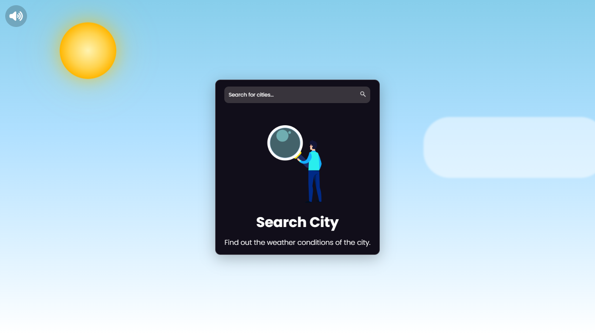

# ArawMo! 🌤️

ArawMo! is a **cute and cozy weather web app** built with **vanilla HTML, CSS, and JavaScript**. It provides real-time weather information from a weather API, along with fun and interactive features to make checking the weather enjoyable.  

---

## Features ✨

- **Search weather by city:** Get weather updates from any city around the world.  
- **Current weather display:** Shows temperature, humidity, wind speed, and weather conditions in text.  
- **Today's forecast (every 3 hours):** View temperature and conditions in 3-hour intervals.  
- **7-day forecast:** See the weather for the upcoming week, including today. Click on a day to view details for that day.  
- **Dynamic day/night theme:** The background and theme change depending on the time of day in your location.  
- **Background music:** Cozy background music plays while you browse the app.  
- **Responsive design:** Works on desktop and mobile devices.  
- **PWA ready:** You can install it on your device for a native app-like experience.  

---

## Screenshots 🖼️

### Home Screen


### 7-Day Forecast


---

## Demo 🌐

You can see the live version of ArawMo! here: [https://araw-mo-weather-app.vercel.app/](https://araw-mo-weather-app.vercel.app/)

---

## Installation 🛠️

To run ArawMo! locally:

1. Clone the repository:

```bash
git clone https://github.com/yourusername/arawmo.git
